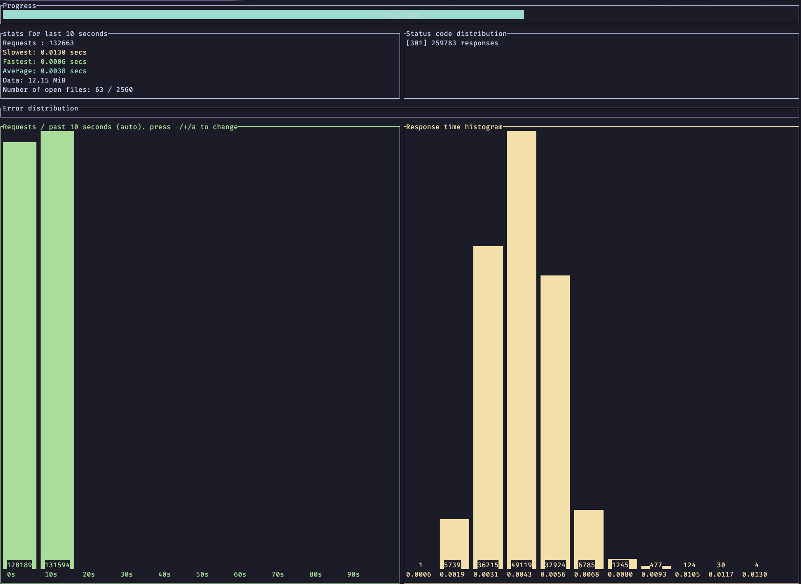

# Benchmarking

Local benchmarks have been performed using [oha](https://github.com/hatoo/oha/),
a descendent of [rakyll/hey](https://github.com/rakyll/hey) written in 🦀 Rust.

<!-- vim-markdown-toc GFM -->

* [Tool Installation](#tool-installation)
* [Running Tests](#running-tests)
  * [Example Results](#example-results)
* [Statistics by Route](#statistics-by-route)

<!-- vim-markdown-toc -->

## Tool Installation

If you've followed the Setup instructions using `mise` with the experimental
`cargo-binstall` support enabled, `oha` should automatically be in your `PATH`.

Otherwise:

```bash
brew install oha
```

## Running Tests

Exercising the new-link form can be performed with `oha`:

```bash
# -z is duration but does not seem to have a long-form flag
oha -z 30s "http://localhost:4001/"
```

Once you've shortened a link and obtained the URL, you can exercise that path as well:

```bash
# -z is duration but does not seem to have a long-form flag
# redirects must be disabled or else load-tests will impact the destination URL
oha --redirect 0 -z 30s "http://localhost:4001/g4ytqz"
```

### Example Results

`oha` has a rather satisfying realtime view during stress tests which looks like this:



When complete, it generates a report like so:

```text
Summary:
  Success rate: 100.00%
  Total:        30.0006 secs
  Slowest:      0.0265 secs
  Fastest:      0.0006 secs
  Average:      0.0038 secs
  Requests/sec: 13145.4496

  Total data:   36.10 MiB
  Size/request: 96
  Size/sec:     1.20 MiB

Response time histogram:
  0.001 [1]      |
  0.003 [133562] |■■■■■■■■■■■■■■■■■
  0.006 [241332] |■■■■■■■■■■■■■■■■■■■■■■■■■■■■■■■■
  0.008 [18106]  |■■
  0.011 [1177]   |
  0.014 [83]     |
  0.016 [23]     |
  0.019 [16]     |
  0.021 [1]      |
  0.024 [13]     |
  0.026 [7]      |

Response time distribution:
  10.00% in 0.0023 secs
  25.00% in 0.0029 secs
  50.00% in 0.0038 secs
  75.00% in 0.0046 secs
  90.00% in 0.0053 secs
  95.00% in 0.0058 secs
  99.00% in 0.0071 secs
  99.90% in 0.0097 secs
  99.99% in 0.0150 secs


Details (average, fastest, slowest):
  DNS+dialup:   0.0012 secs, 0.0007 secs, 0.0015 secs
  DNS-lookup:   0.0000 secs, 0.0000 secs, 0.0003 secs

Status code distribution:
  [301] 394321 responses

Error distribution:
  [50] aborted due to deadline
```

_These results taken from my machine running against a `MIX_ENV=prod` release
running via Docker-Compose._

## Statistics by Route

All measurements were worst-of-3 of 30-second test runs taken on:

- 16" MacBook Pro (2023)
- M2 Max (ARM)
- 64 GB
- MacOS 14.4.1
- Plugged into mains power
- Chassis comfortably cool to touch

Docker Desktop 4.28.0 VM had the following resource allocations:

- CPU Limit: 12
- Memory Limit: 7.9GB
- Swap: 1GB
- Virtual Disk Limit: 64GB

The application was deployed according to the Docker-Compose instructions and
configuration, so using a compiled release with `MIX_ENV=prod`.
The BEAM container was restarted between runs, but PostgreSQL was not.
The `links` table had 3 rows, `link_visits` had 3 rows.

| Route    | Req/Sec | P50 Duration (millisec) | P99 Duration (ms) | Total Data |
| -------- | ------- | ----------------------- | ----------------- | ---------- |
| `/`      | 8236    | 6                       | 10.5              | 562.25 MiB |
| `/stats` | 8240    | 6                       | 9.5               | 504.88 MiB |
| `/:slug` | 15252   | 3.2                     | 7.2               | 44.51 MiB  |
